# 拓扑排序

有向无环图：DAG。（有一条双向边也相当于有环）

## 概念

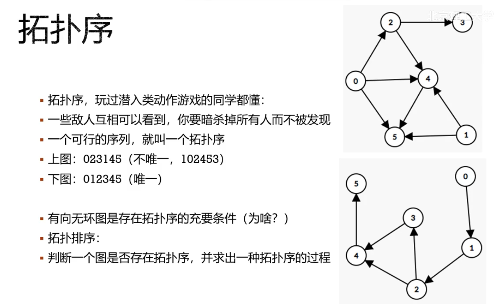

## 基本步骤

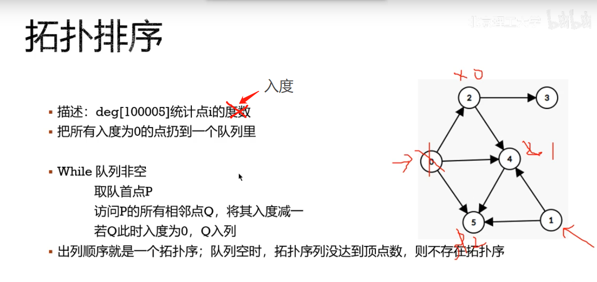

## 具体操作

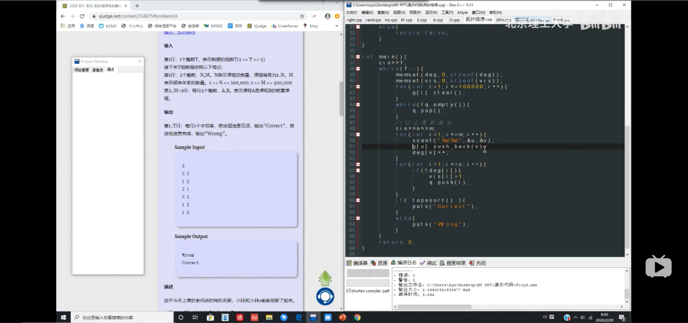

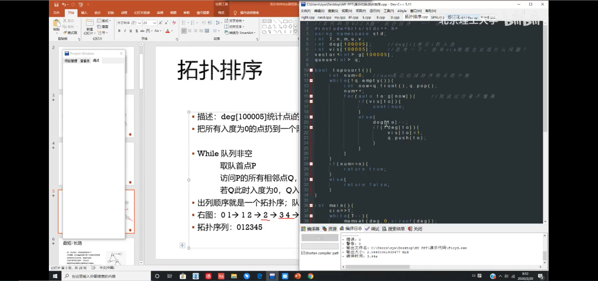

## 最短路/最长路

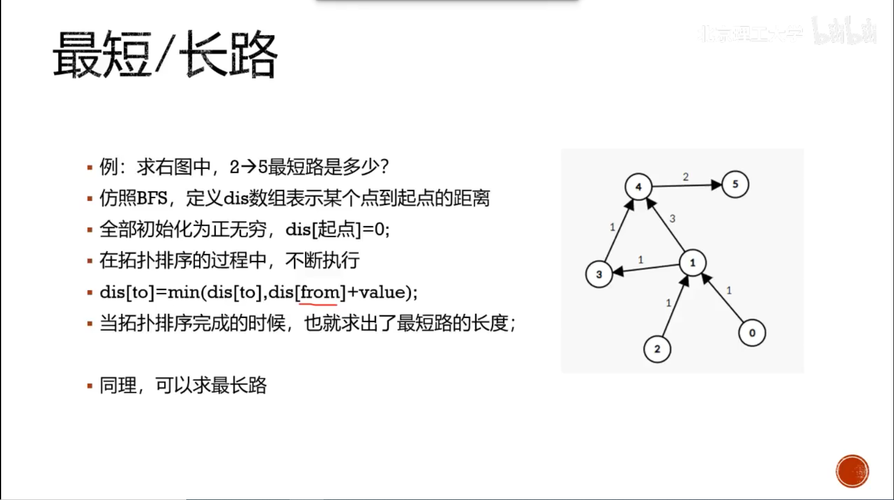

动态规划实际上是在一张有向无环图上进行拓扑排序的过程。

# 最短路

## BFS

一般BFS求最短路要求边的权重相同。

SPFA

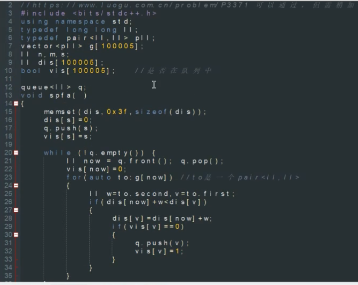

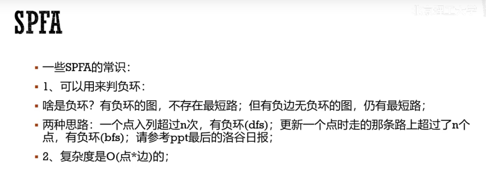

著名笑话：

## Dijkstra

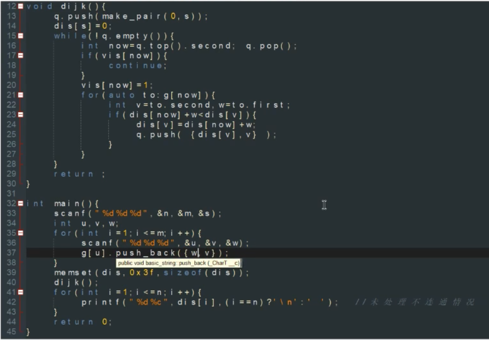

用了pair自定义的排序，所以第一位为距离。

准确的说这是堆优化下的dijkstra，普通的遍历找最短距离最近的点。

## Bellman-ford

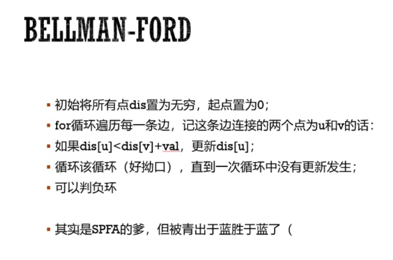

SPFA是队列优化的Bellman，一般不会用到bellman。

（话说图里的式子是不是搞反了）

## Floyd

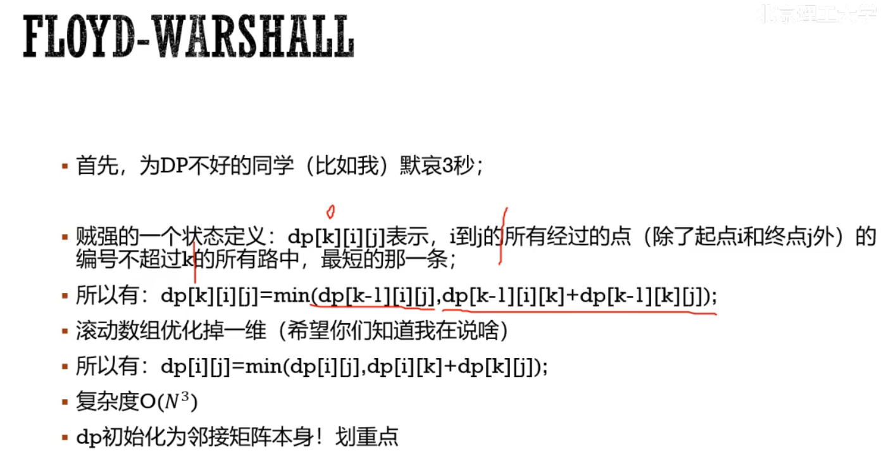

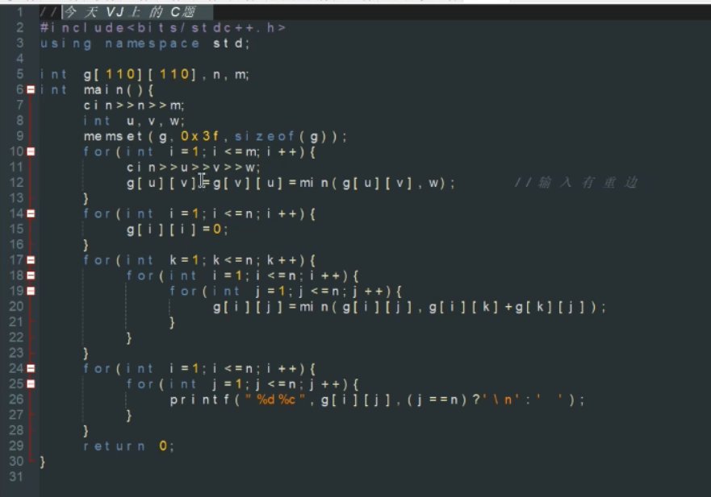

## 总结

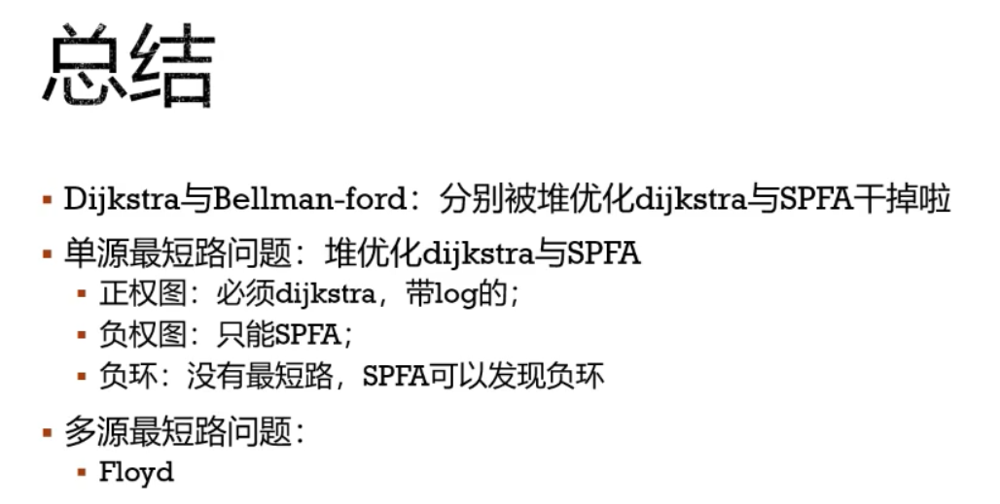

## tip

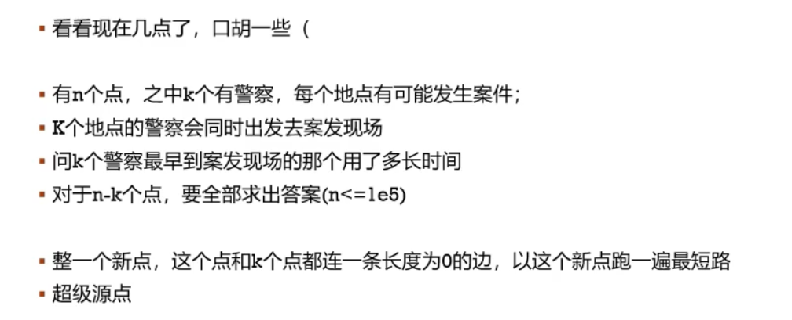

# 题目

