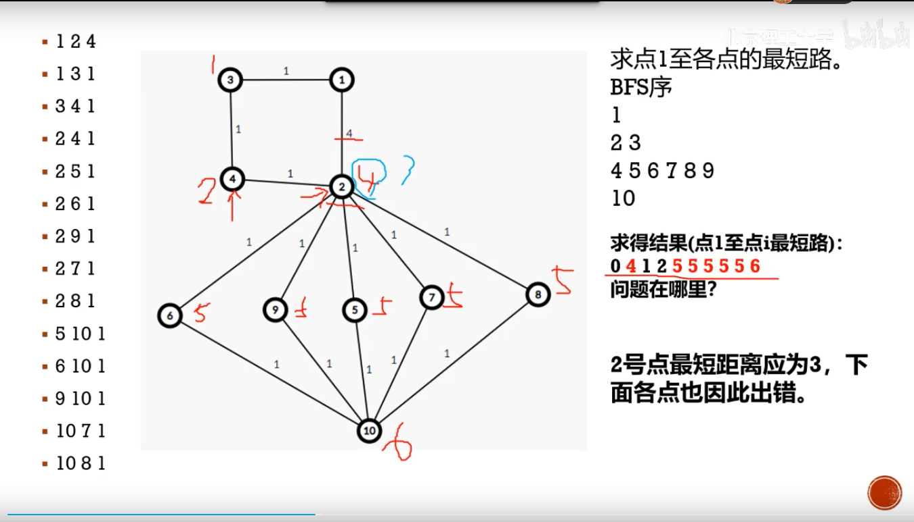
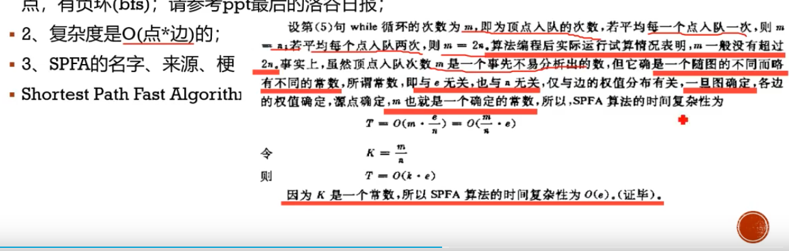

# 拓扑排序

有向无环图：DAG。（有一条双向边也相当于有环）

## 概念

## 基本步骤

## 具体操作

## 最短路/最长路

动态规划实际上是在一张有向无环图上进行拓扑排序的过程。

# 最短路

## BFS

一般BFS求最短路要求边的权重相同。

SPFA

著名笑话：

## Dijkstra

用了pair自定义的排序，所以第一位为距离。

准确的说这是堆优化下的dijkstra，普通的遍历找最短距离最近的点。

## Bellman-ford

SPFA是队列优化的Bellman，一般不会用到bellman。

（话说图里的式子是不是搞反了）

## Floyd

## 总结

## tip

# 题目

