# 并查集

解决方法：

1. 图染色，合并复杂度高，查询O（1）；
2. 并查集；

## 概念

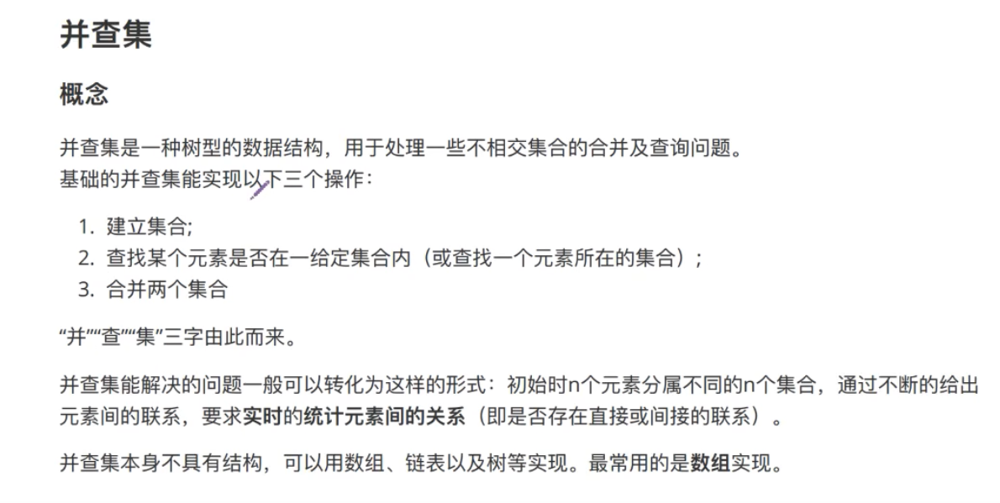

## 实现

1. 数组实现

建立标记数组father，用father[]表示元素i所属集合(头目)的标记。

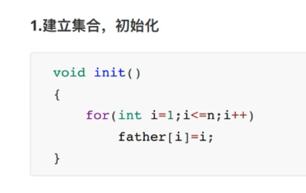

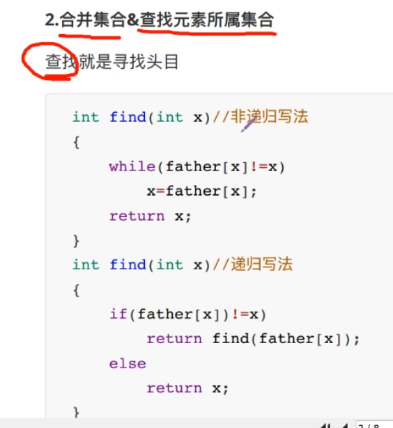

看到这里突然感觉和Dijkstra记录路径的方法类似

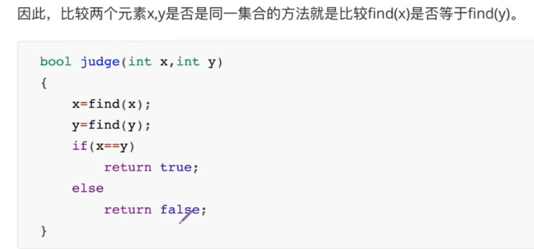

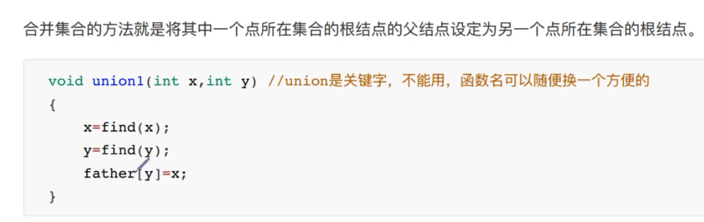

## 优化

对整体数据结构的优化，在find函数中优化。

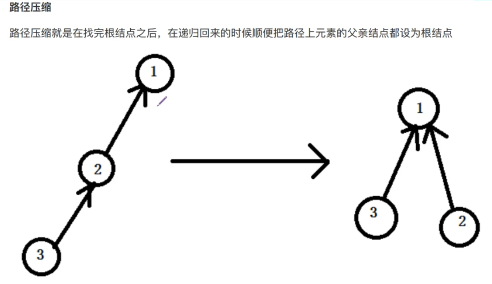

树状结构可能变成线状结构。

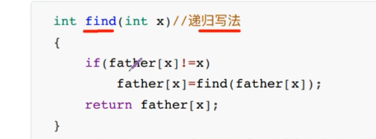

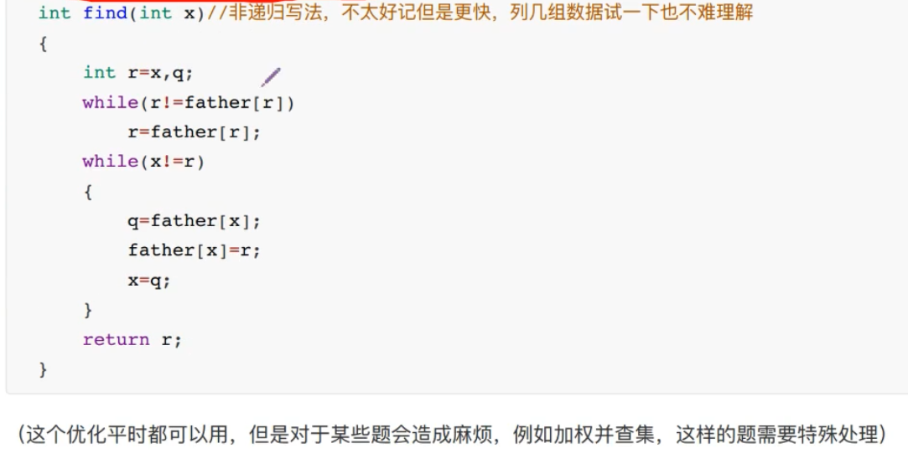

一般写递归即可。复杂度log级。

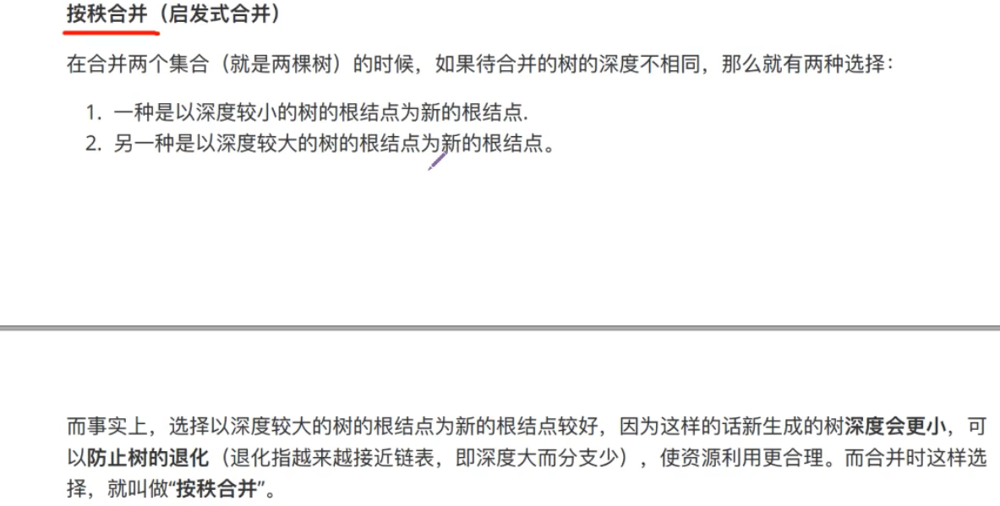

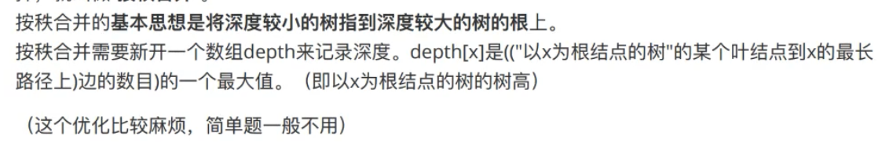

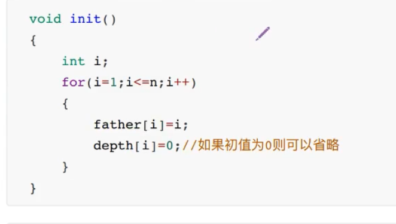

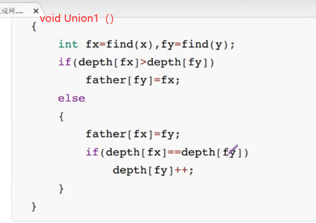

## 变种

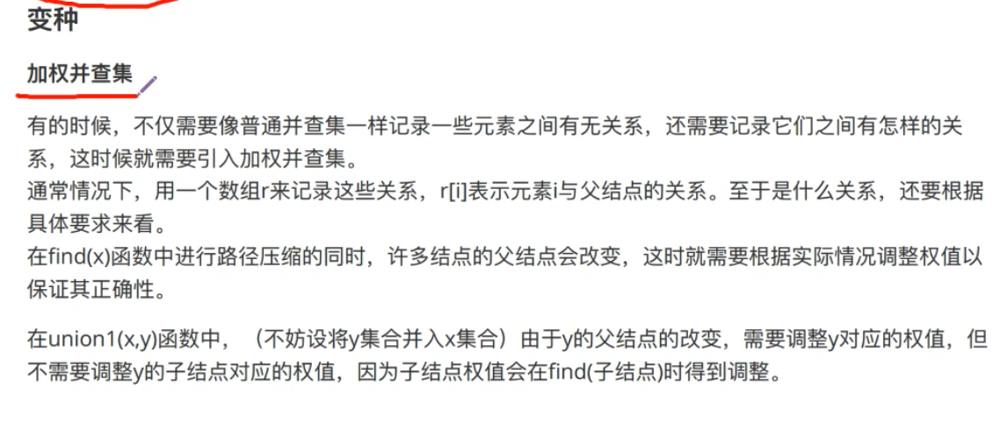

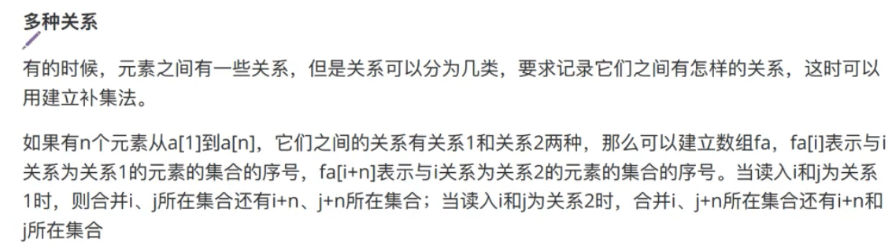

# 最小生成树

## kruskal算法

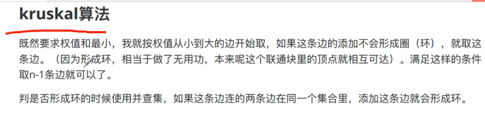

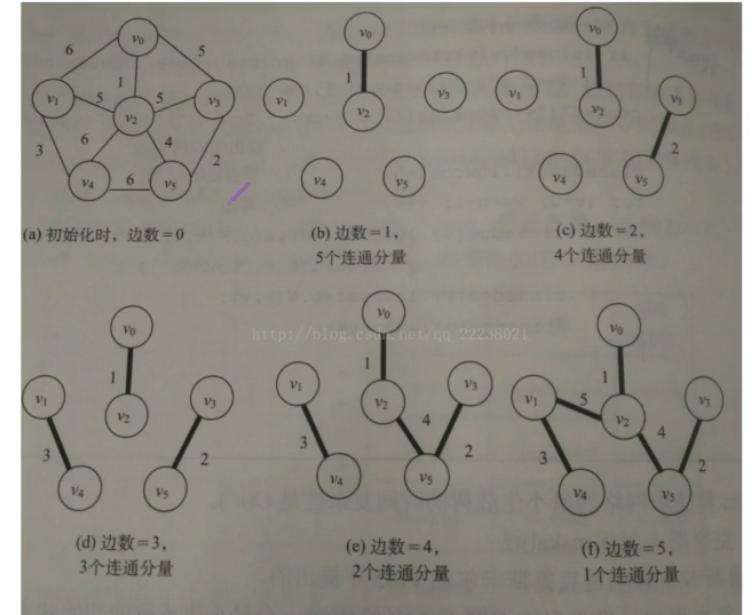

### 实现

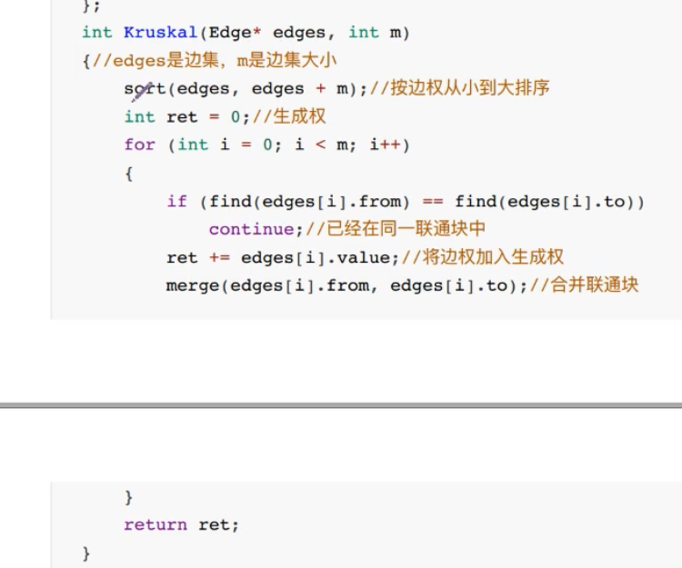

使用路径压缩，平均复杂度ElogE

## prim算法

用的不多。和Dijkstra有点像。

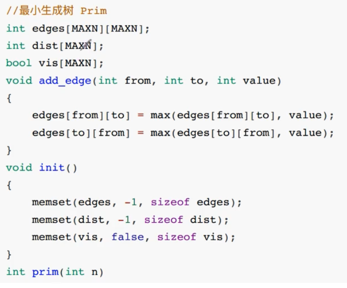

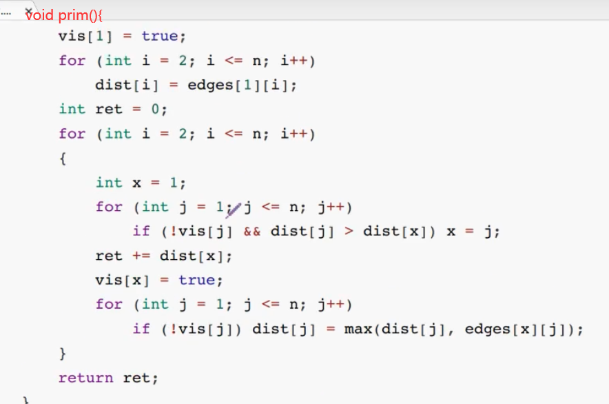