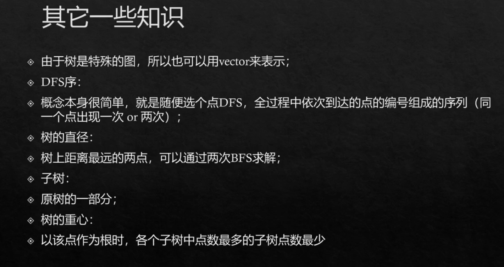
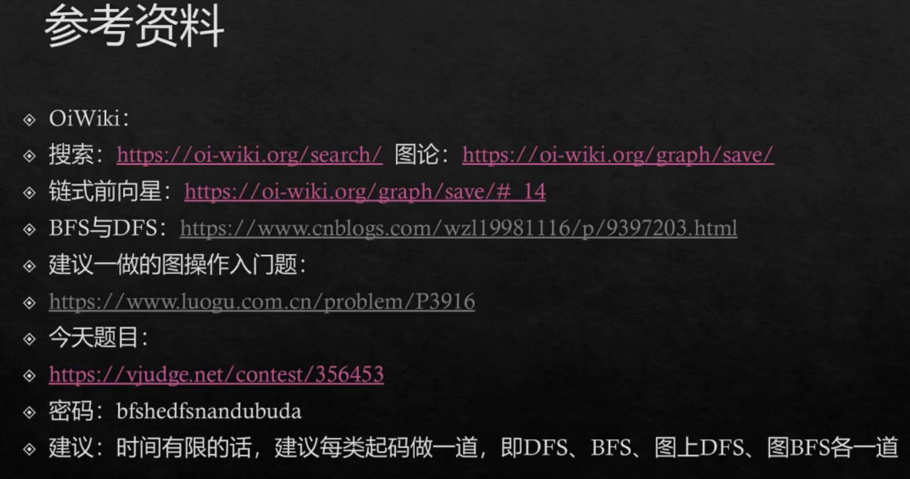

# DFS&BFS&图

next_permutation()函数可以生成下一个全排列，并判断是否已经生成n!个全排列。（需要定义＜）

DFS求全排序时间复杂度O(n!)

集合的枚举：选或不选。

复杂度O(2^n)

位运算处理集合速度非常快

数独与剪枝：

V1.0：所有位置填满1~9的数字，类似全排列。

V2.0：可行性剪枝：每填入一个数字check一次。所有空位置上填合法数字，填满即为答案。

V3.0：搜索顺序剪枝：在所有位置中，总是选择合法数字最少的位置来填。（对搜索可行解的题目）

剪枝没有改变复杂度。

枚举一个点周围四个点：利用数组高效实现

八连块问题，用dfs做比较简单，紫书U6中有过。

迷宫问题：

图：

输出的一些操作：

pair<int, int>+vector实现邻接表存储带权图

存图：

DFS遍历：

BFS遍历，顺便找到某起点最短路距离（dis数组）：

刷题点;

bfs和dfs难度不大~

L题和之后难度很大，不用强求。