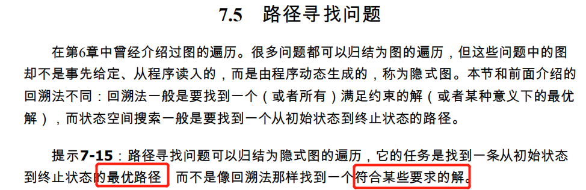

# U6 暴力

## 例题一览

## 解答树

类似DFS，递归遍历。

tips：解答树的节点大多数源于最后两层，以上部分可以忽略不计。

## next_permutation

北理DFS一讲中提到过。按字典序最小开始生成全排列，需要定义<。

## 二进制表示集合

昨天也提到过，与或非计算符可以轻松实现集合操作。

## 回溯法

特点：

昨天做DFS的素数环，可以生成素数表预处理：

回溯法的题目因为昨天做过几道，今天就不细作了。tips：计算量较大的全排列题目都可以考虑用DFS加上适当的剪枝方法做。剪枝方法有些没那么明显，需要适当思考。

## 路径寻找

可行解DFS，最短路BFS。

### 八数码问题

标记一下八数码问题，本来想做一下，但好像不是UVA上的，书上介绍很全，就不具体写了。

mark是因为以前JS做过一个八数码的练习小游戏，那时候还不知道这叫八数码......下次可以考虑把算法加进去。[八数码问题JS游戏版](https://github.com/zll-hust/JavaScript-practice/tree/master/7.网页版拼图游戏)

Mark一下解决算法：

最短路+BFS。图的每一个状态表示一个点，如左图为264137058，表示一个点，有两条无向边连接164037157以及164137058两个点。点的个数就有9的全排列个。问题就是求初始点到1234567890的最短路。最短路用BFS比较好。

查重优化：

1. vis数组判断是否访问改为编码解码，化为整数。
2. 哈希技术。设计哈希函数，将节点映射到整数。哈希函数可能导致两点哈希值相同，所以需要设计链表的结构，对相同哈希值的节点进行插入。合理的哈希函数可以避免大量哈希值相同的情况，从而提高效率。如果哈希值相同情况过多，哈希表会退化为链表查找速度就很慢。其实第一种方法相当于设计了无重复的哈希函数。
3. 使用STL的set。（STL, yyds!）（三个版本中set速度最慢）

### 7-8 Fill

倒水问题也可以建模为一幅有向图。每一杯杯子的水量为一个向量，构成一个三元组表示一个状态——也就是点。

那么用类似BFS的方法遍历整个图，把每个点对应的最短路都保存下来，相当于单源最短路，就能得到最后的答案。实际上算法更像Dijstra，Dijstra本身就很像BFS，求的也是单源最短路。题目要求的最短是水量最少，所以不是每次取出步数最少的结点进行扩展，只需要把队列queue换成优先队列priority_queue，设置<为水量即可，这个方法在昨天B题也用到过。

书中代码中间的一些细节也做的很好，值得仔细看看。

### 7-10 The Morning after Halloween

直接BFS容易超时，需要优化。一个优化方向是把空格单独提取出来，形成新的图，因为题目告诉我们障碍物很多。

以前没搞过这种方法，就百度查了一下，然后还是写了个半死。具体看代码吧，有点累了....

## 迭代加深搜索

mark一下A*，要学一下。

本来想好好做一下这题，但做了好久还是做错了，实在不想做了，哎。